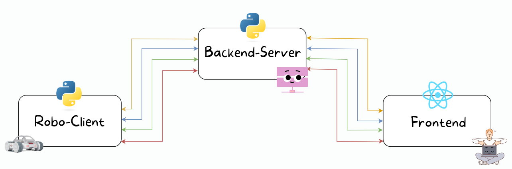
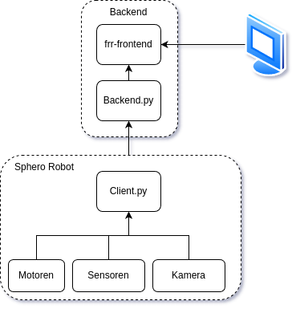

# FRR
Fantastic RPC Robot

## Technologies

- Python
- Reac
- sphero SDK

## Architecture
### Verteilungsdiagram

### Komponentendiagram

## Hardware-Client

Der Sphero-Roboter wird mithilfe des Sphero SDK und Python auf einem Raspberry Pi gesteuert. Eine am Roboter befestigte Webcam überträgt einen Live-Video-Stream an das Backend. Eine 3D-gedruckte Halterung sorgt dafür, dass sowohl der Raspberry Pi als auch die Webcam stabil am Roboter montiert sind. Die Kommunikation zwischen dem Raspberry Pi und dem Roboter erfolgt über eine serielle Schnittstelle.

Auf dem Raspberry Pi läuft die Python Anwendung, welche als Benutzerschnittstelle genutzt wird, so wird zum Start eine Verbindung auf das Netzwerk ``robowifi`` hergestellt. Beim Start der Anwendung wird nun eine Websocket Verbindung zu dem Backend herrgestellt. Dabei werden alle zwei Sekunden Sensorwerte übertragen. Die IMU ist dabei der am häufigsten abgefragte Sensor, da dieser wichtige Bewegungsdaten liefert. Werte sind dabei Himmelsrichtung, Beschleunigung und die Geschwindigkeit. 

Über das Front-End werden nun der Tastatur Druck übermittelt. Der Client wertet diese nun aus und sendet Befehle an die Tank Drive Engine, welche mithilfe einer State Machine die Richtung und Geschwindigkeit des Roboters kontrolliert. Als Methode wird dabei das drive with heading, welches die Richtung über den Magnetometer bestimmt ![[1]](file:///home/maylis/Downloads/SpheroRVRControlSystemManual-1.pdf).

### Anwendung starten
1. Eine SSH Verbindung muss zum Roboter hergestellt werden.
2. Die IP Adresse auf den der Client zugreift muss konfiguriert sein. Diese kann innerhalb der ``Client.py`` eingestellt werden.
3. Eine Virtual Enviroment muss angelegt werden dies kann über folgendes  durchgeführt werden.
4. Die Anwendung kann gestartet werden ``python Kommunikation/Client.py``

## Frontend

## Backend

## Challenges

### Netzwerkverbingung und Entwicklungsumgebung

Zwischen den verschiedenen Komponenten existierte keine gemeinsame Verbindung. Aus diesem Grund wurde ein WLAN-Netzwerk eingerichtet, um die Kommunikation zu ermöglichen.

### Latenz
Zu Beginn gab es eine erhebliche Verzögerung von bis zu 15 Sekunden beim Video-Stream. Die Lösung bestand darin, die Daten in Base64 umzuwandeln und auf den Einsatz eines Buffers zu verzichten, um die Übertragungsverzögerung zu minimieren.
